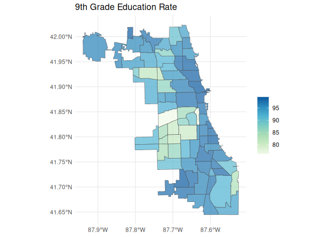

<!-- README.md is generated from README.Rmd. Please edit that file -->

# healthatlas

<!-- badges: start -->

[](https://ryanzomorrodi.r-universe.dev/healthatlas)
[](https://github.com/ryanzomorrodi/healthatlas/actions/workflows/R-CMD-check.yaml)

<!-- badges: end -->

Explore and Import *Metopio* Powered Health Atlases.

[Metopio](https://metopio.com/) helps many public health departments
build curated data platforms. These data platforms are a convenient way
for community members and researchers to explore and download public
health data. With the same spirit in mind, this package aim to make
interfacing with these data portals within R more **painless** and
**reproducible**.

**Note:** This is an unofficial R wrapper for Metopio Health Atlases.
This package is in no way affiliated with the Metopio or any of the
public health departments Metopio serves.

Examples of Metopio health atlases include:

- Chicago Health Atlas: <https://chicagohealthatlas.org/>  
- Cook County Health Atlas: <https://cookcountyhealthatlas.org/>  
- Idaho Oregon Community Health Atlas:
  <https://idahooregoncommunityhealthatlas.org/>  
- Northern Kentucky Atlas:
  <https://atlas.northernkentuckyusa.com/>

## Installation

You can install the development version of healthatlas from
[GitHub](https://github.com/ryanzomorrodi/healthatlas) with:

``` r
# install.packages("pak")
pak::install("ryanzomorrodi/healthatlas")
```

## Usage

``` r
library(healthatlas)
```

Set your health atlas. For this example, we are going to use the Chicago
Health Atlas, and can do so, by providing the Chicago Health Atlas URL
to `ha_set()`.

``` r
ha_set("chicagohealthatlas.org")
```

We can list all the topics (aka indicators) present within Chicago
Health Atlas using `ha_topics()`. The most important column here is the
`topic_key` which can be used to identify the topic within subsequent
functions.

``` r
ha_topics(progress = FALSE)
#> # A tibble: 403 × 7
#>    topic_name           topic_key topic_description topic_units subcategory_name
#>    <chr>                <chr>     <chr>             <chr>       <chr>           
#>  1 9th grade education… EDA       Residents 25 or … % of resid… Education       
#>  2 ACA marketplace enr… ENR       Number of plan s… plan selec… Access to Care  
#>  3 Accidents mortality  VRAC      Number of people… count of d… Injury & Violen…
#>  4 Accidents mortality… VRACR     Age-adjusted rat… per 100,00… Injury & Violen…
#>  5 Active business lic… CHANVYI   Count of active … licenses p… Income          
#>  6 Adult asthma         HCSATH    Number of adults… count of a… Chronic Disease 
#>  7 Adult asthma rate    HCSATHP   Percent of adult… % of adults Chronic Disease 
#>  8 Adult binge drinking HCSBD     Number of adults… count of a… Alcohol & Drug …
#>  9 Adult binge drinkin… HCSBDP    Percent of adult… % of adults Alcohol & Drug …
#> 10 Adult diabetes       HCSDIA    Number of adults… count of a… Chronic Disease 
#> # ℹ 393 more rows
#> # ℹ 2 more variables: subcategory_key <chr>, category <chr>
```

Then, we can explore what populations, time periods, and geographic
scales that data is available for using `ha_coverage()`. Again, the most
important columns here are the key columns which can be used to specify
the data desired.

``` r
ha_coverage("EDA", progress = FALSE)
#> # A tibble: 132 × 6
#>    population_key population_name population_grouping period_key layer_key
#>    <chr>          <chr>           <chr>               <chr>      <chr>    
#>  1 ""             Full population ""                  2018-2022  place    
#>  2 ""             Full population ""                  2022       place    
#>  3 ""             Full population ""                  2017-2021  place    
#>  4 ""             Full population ""                  2021       place    
#>  5 ""             Full population ""                  2016-2020  place    
#>  6 ""             Full population ""                  2015-2019  place    
#>  7 ""             Full population ""                  2019       place    
#>  8 ""             Full population ""                  2014-2018  place    
#>  9 ""             Full population ""                  2018       place    
#> 10 ""             Full population ""                  2013-2017  place    
#> # ℹ 122 more rows
#> # ℹ 1 more variable: layer_name <chr>
```

Now, we can import our data using `ha_data()` specifying the keys we
identified above.

``` r
data <- ha_data(
  topic_key = "EDA",
  population_key = "",
  period_key = "2018-2022",
  layer_key = "neighborhood"
)
data
#> # A tibble: 77 × 4
#>    geoid      measure value standardError
#>    <chr>      <chr>   <dbl>         <dbl>
#>  1 1714000-35 EDA      96.1          4.64
#>  2 1714000-36 EDA      98.5          4.64
#>  3 1714000-37 EDA      96.0          6.93
#>  4 1714000-38 EDA      97.0          4.69
#>  5 1714000-39 EDA      98.4          7.34
#>  6 1714000-4  EDA      96.1          3.18
#>  7 1714000-40 EDA      97.5          6.86
#>  8 1714000-41 EDA      99.0          5.27
#>  9 1714000-42 EDA      96.3          3.63
#> 10 1714000-1  EDA      93.9          2.72
#> # ℹ 67 more rows
```

Let’s create a map. But first, we will need to download the Community
Areas geographic layer. We can do that with `ha_layer()`.

``` r
layer <- ha_layer(
  layer_key = "neighborhood"
)
layer
#> Simple feature collection with 77 features and 6 fields
#> Geometry type: MULTIPOLYGON
#> Dimension:     XY
#> Bounding box:  xmin: -87.94011 ymin: 41.64454 xmax: -87.52419 ymax: 42.02305
#> Geodetic CRS:  WGS 84
#> # A tibble: 77 × 7
#>    layer_key    geoid     name  population state notes                  geometry
#>  * <chr>        <chr>     <chr>      <int> <chr> <chr>        <MULTIPOLYGON [°]>
#>  1 neighborhood 1714000-1 Roge…      55454 IL    Far … (((-87.65456 41.99818, -…
#>  2 neighborhood 1714000-… Norw…      41069 IL    Far … (((-87.78002 41.99742, -…
#>  3 neighborhood 1714000-… Jeff…      26201 IL    Far … (((-87.75264 41.96798, -…
#>  4 neighborhood 1714000-… Fore…      19579 IL    Far … (((-87.72642 41.99726, -…
#>  5 neighborhood 1714000-… Nort…      17522 IL    Far … (((-87.7069 41.98309, -8…
#>  6 neighborhood 1714000-… Alba…      48549 IL    Far … (((-87.70404 41.97356, -…
#>  7 neighborhood 1714000-… Port…      63038 IL    Nort… (((-87.75264 41.96798, -…
#>  8 neighborhood 1714000-… Irvi…      51911 IL    Nort… (((-87.69475 41.96128, -…
#>  9 neighborhood 1714000-… Dunn…      43120 IL    Nort… (((-87.77621 41.93846, -…
#> 10 neighborhood 1714000-… Mont…      14412 IL    Nort… (((-87.78942 41.91752, -…
#> # ℹ 67 more rows
```

Now we can make our map!

``` r
library(dplyr)
library(ggplot2)

map_data <- layer |>
  left_join(data, "geoid") 

ggplot(map_data) +
  geom_sf(aes(fill = value), alpha = 0.7) +
  scale_fill_distiller(palette = "GnBu", direction = 1) +
  labs(
    title = "9th Grade Education Rate",
    fill = ""
  ) +
  theme_minimal()
```


