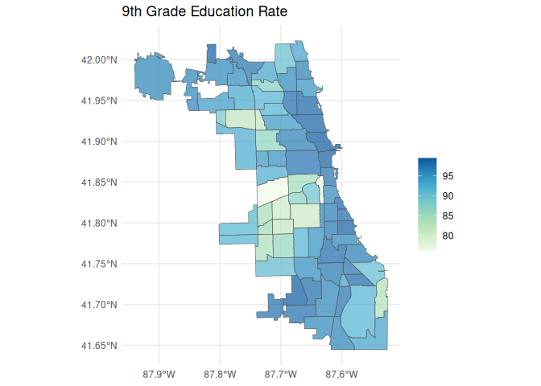

<!-- README.md is generated from README.Rmd. Please edit that file -->

# healthatlas

<!-- badges: start -->

[](https://ryanzomorrodi.r-universe.dev/healthatlas)
[](https://github.com/ryanzomorrodi/healthatlas/actions/workflows/R-CMD-check.yaml)
[](https://app.codecov.io/gh/ryanzomorrodi/healthatlas?branch=main)
<!-- badges: end -->

Explore and Import *Metopio* Powered Health Atlases.

[Metopio](https://metopio.com/) helps many public health departments
build curated data platforms. These data platforms are a convenient way
for community members and researchers to explore and download public
health data. With the same spirit in mind, this package aims to make
interfacing with these data portals within R more **painless** and
**reproducible**.

**Note:** This is an unofficial R wrapper for Metopio Health Atlases.
This package is in no way affiliated with the Metopio or any of the
public health departments Metopio serves.

Examples of Metopio health atlases include:

- Chicago Health Atlas: <https://chicagohealthatlas.org/>  
- Cook County Health Atlas: <https://cookcountyhealthatlas.org/>  
- University of Illinois Cancer Center Data Hub:
  <https://uicc.metop.io/>  
- Idaho Oregon Community Health Atlas:
  <https://idahooregoncommunityhealthatlas.org/>  
- Northern Kentucky Atlas: <https://atlas.northernkentuckyusa.com/>
- Allen County Health Atlas: <https://allencountyhealthatlas.org/>
- Kane County Health Atlas: <https://kanehealthatlas.org/>
- Contra Costa Health Atlas: <https://atlas.cchealth.org/>

## Installation

You can install healthatlas from CRAN.

``` r
install.packages("healthatlas")
```

Or, you can install the development version of healthatlas from
[R-universe](https://ryanzomorrodi.r-universe.dev/healthatlas) with:

``` r
install.packages("healthatlas", repos = c("https://ryanzomorrodi.r-universe.dev", "https://cloud.r-project.org"))
```

## Usage

``` r
library(healthatlas)
```

Set your health atlas. For this example, we are going to use the Chicago
Health Atlas, and can do so, by providing the Chicago Health Atlas URL
to `ha_set()`.

``` r
ha_set("chicagohealthatlas.org")
```

We can list all the topics (aka indicators) present within Chicago
Health Atlas using `ha_topics()`. The most important column here is the
`topic_key` which can be used to identify the topic within subsequent
functions.

``` r
ha_topics(progress = FALSE)
#> # A tibble: 408 × 7
#>    topic_name             topic_key topic_description topic_units topic_keywords
#>    <chr>                  <chr>     <chr>             <chr>       <list>        
#>  1 9th grade education r… EDA       Residents 25 or … % of resid… <chr [2]>     
#>  2 ACA marketplace enrol… ENR       Number of plan s… plan selec… <chr [5]>     
#>  3 Accidents mortality    VRAC      Number of people… count of d… <chr [2]>     
#>  4 Accidents mortality r… VRACR     Age-adjusted rat… per 100,00… <chr [2]>     
#>  5 Active business licen… CHANVYI   Count of active … licenses p… <chr [1]>     
#>  6 Adult asthma           HCSATH    Number of adults… count of a… <chr [2]>     
#>  7 Adult asthma rate      HCSATHP   Percent of adult… % of adults <chr [2]>     
#>  8 Adult binge drinking   HCSBD     Number of adults… count of a… <chr [1]>     
#>  9 Adult binge drinking … HCSBDP    Percent of adult… % of adults <chr [1]>     
#> 10 Adult diabetes         HCSDIA    Number of adults… count of a… <chr [1]>     
#> # ℹ 398 more rows
#> # ℹ 2 more variables: topic_datasets <list>, topic_subcategories <list>
```

Then, we can explore what populations, time periods, and geographic
scales that data is available for using `ha_coverage()`. Again, the most
important columns here are the key columns which can be used to specify
the data desired.

``` r
ha_coverage("EDA", progress = FALSE)
#> # A tibble: 153 × 7
#>    topic_key population_key population_name population_grouping period_key
#>    <chr>     <chr>          <chr>           <chr>               <chr>     
#>  1 EDA       ""             Full population ""                  2007-2011 
#>  2 EDA       ""             Full population ""                  2012-2016 
#>  3 EDA       "F"            Female          "Sex"               2014-2018 
#>  4 EDA       ""             Full population ""                  2010-2014 
#>  5 EDA       ""             Full population ""                  2011-2015 
#>  6 EDA       ""             Full population ""                  2015-2019 
#>  7 EDA       ""             Full population ""                  2014-2018 
#>  8 EDA       ""             Full population ""                  2017-2021 
#>  9 EDA       ""             Full population ""                  2006-2010 
#> 10 EDA       "F"            Female          "Sex"               2016-2020 
#> # ℹ 143 more rows
#> # ℹ 2 more variables: layer_key <chr>, layer_name <chr>
```

Now, we can import our data using `ha_data()` specifying the keys we
identified above.

``` r
data <- ha_data(
  topic_key = "EDA",
  population_key = "",
  period_key = "2018-2022",
  layer_key = "neighborhood"
)
data
#> # A tibble: 77 × 7
#>    geoid      topic_key population_key period_key layer_key  value standardError
#>    <chr>      <chr>     <chr>          <chr>      <chr>      <dbl>         <dbl>
#>  1 1714000-14 EDA       ""             2018-2022  neighborh…  87.5          3.25
#>  2 1714000-18 EDA       ""             2018-2022  neighborh…  88.8          3.32
#>  3 1714000-2  EDA       ""             2018-2022  neighborh…  90.2          3.64
#>  4 1714000-24 EDA       ""             2018-2022  neighborh…  96.8          1.87
#>  5 1714000-43 EDA       ""             2018-2022  neighborh…  96.9          3.87
#>  6 1714000-45 EDA       ""             2018-2022  neighborh…  97.7         13.1 
#>  7 1714000-47 EDA       ""             2018-2022  neighborh…  93.7         21.9 
#>  8 1714000-49 EDA       ""             2018-2022  neighborh…  96.4          4.66
#>  9 1714000-52 EDA       ""             2018-2022  neighborh…  83.5          3.71
#> 10 1714000-6  EDA       ""             2018-2022  neighborh…  98.9          1.91
#> # ℹ 67 more rows
```

Let’s create a map. But first, we will need to download the Community
Areas geographic layer. We can do that with `ha_layer()`.

``` r
layer <- ha_layer(
  layer_key = "neighborhood"
)
layer
#> Simple feature collection with 77 features and 6 fields
#> Geometry type: MULTIPOLYGON
#> Dimension:     XY
#> Bounding box:  xmin: -87.94011 ymin: 41.64454 xmax: -87.52419 ymax: 42.02305
#> Geodetic CRS:  WGS 84
#> First 10 features:
#>         geoid    layer_key                         name population state
#> 1   1714000-1 neighborhood    Rogers Park (Chicago, IL)      55454    IL
#> 2  1714000-10 neighborhood   Norwood Park (Chicago, IL)      41069    IL
#> 3  1714000-11 neighborhood Jefferson Park (Chicago, IL)      26201    IL
#> 4  1714000-12 neighborhood    Forest Glen (Chicago, IL)      19579    IL
#> 5  1714000-13 neighborhood     North Park (Chicago, IL)      17522    IL
#> 6  1714000-14 neighborhood    Albany Park (Chicago, IL)      48549    IL
#> 7  1714000-15 neighborhood   Portage Park (Chicago, IL)      63038    IL
#> 8  1714000-16 neighborhood    Irving Park (Chicago, IL)      51911    IL
#> 9  1714000-17 neighborhood        Dunning (Chicago, IL)      43120    IL
#> 10 1714000-18 neighborhood      Montclare (Chicago, IL)      14412    IL
#>             notes                       geometry
#> 1  Far North Side MULTIPOLYGON (((-87.65456 4...
#> 2  Far North Side MULTIPOLYGON (((-87.78002 4...
#> 3  Far North Side MULTIPOLYGON (((-87.75264 4...
#> 4  Far North Side MULTIPOLYGON (((-87.72642 4...
#> 5  Far North Side MULTIPOLYGON (((-87.7069 41...
#> 6  Far North Side MULTIPOLYGON (((-87.70404 4...
#> 7  Northwest Side MULTIPOLYGON (((-87.75264 4...
#> 8  Northwest Side MULTIPOLYGON (((-87.69475 4...
#> 9  Northwest Side MULTIPOLYGON (((-87.77621 4...
#> 10 Northwest Side MULTIPOLYGON (((-87.78942 4...
```

Now we can make our map!

``` r
library(dplyr)
library(ggplot2)

map_data <- layer |>
  left_join(data, "geoid") 

ggplot(map_data) +
  geom_sf(aes(fill = value), alpha = 0.7) +
  scale_fill_distiller(palette = "GnBu", direction = 1) +
  labs(
    title = "9th Grade Education Rate",
    fill = ""
  ) +
  theme_minimal()
```


