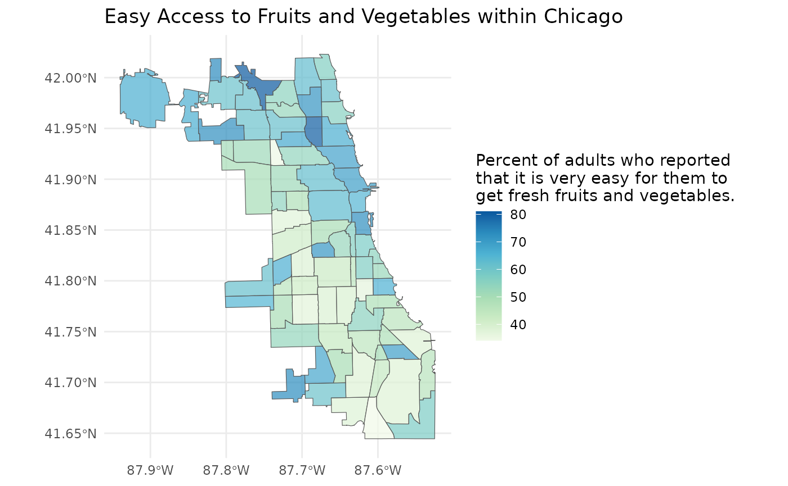
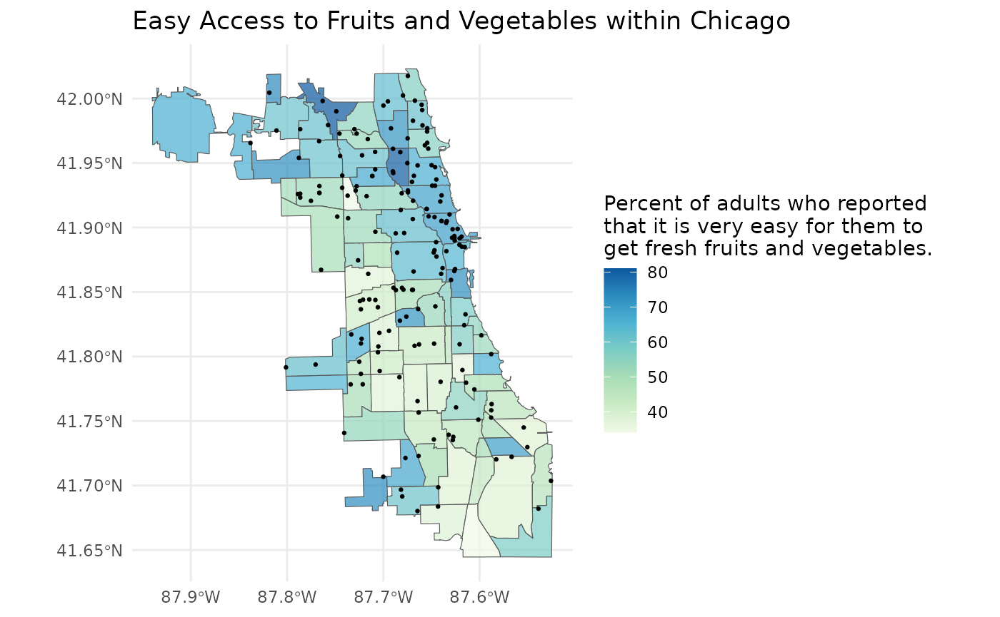

# Get started

## Discover indicators

``` r

library(healthatlas)
```

Let’s set our health atlas. For this example we will use the Chicago
Health Atlas. We can do so by calling
[`ha_set()`](https://ryanzomorrodi.github.io/healthatlas/reference/ha_set.md)
with the Chicago Health Atlas URL.

``` r

ha_set("chicagohealthatlas.org")
```

If we need to check which health atlas we are using, we can use
[`ha_get()`](https://ryanzomorrodi.github.io/healthatlas/reference/ha_get.md).

``` r

ha_get()
#> [1] "https://chicagohealthatlas.org/api/v1/"
```

We can list all the topics (aka indicators) present within Chicago
Health Atlas by using
[`ha_topics()`](https://ryanzomorrodi.github.io/healthatlas/reference/ha_topics.md).
The most important column here is the `topic_key`. An individual
`topic_key` can be used to identify a topic within subsequent functions.

``` r

topics <- ha_topics(progress = FALSE)
topics
#> # A tibble: 463 × 7
#>    topic_name             topic_key topic_description topic_units topic_keywords
#>    <chr>                  <chr>     <chr>             <chr>       <list>        
#>  1 Active transportation… ACT       Percent of worke… "% of work… <chr [3]>     
#>  2 Area Deprivation Index ADI       The ADI is a ran… ""          <chr [0]>     
#>  3 Asthma (CDC Places)    AST       Percent of adult… "% of adul… <chr [0]>     
#>  4 Expected annual build… BAL       Building loss qu… ""          <chr [6]>     
#>  5 Have ever had cancer   CAN       Percent of resid… "% of adul… <chr [4]>     
#>  6 Drive alone to work    CAR       Percent of worke… "% of work… <chr [0]>     
#>  7 Invasive breast cance… CCB       Annual diagnosis… "per 100,0… <chr [4]>     
#>  8 Cervical cancer diagn… CCC       Annual diagnosis… "per 100,0… <chr [5]>     
#>  9 Oral cancer diagnosis… CCD       Annual diagnosis… "per 100,0… <chr [4]>     
#> 10 Lung cancer diagnosis… CCG       Annual diagnosis… "per 100,0… <chr [5]>     
#> # ℹ 453 more rows
#> # ℹ 2 more variables: topic_datasets <list>, topic_subcategories <list>
```

**Note:** topics can be derived from multiple datasets or belong to
multiple subcategories or keywords. Therefore, these columns may be
composed of `tibble`s or vectors. Filtering topics via these pieces of
information is still quite easy using
[`purrr::map_lgl()`](https://purrr.tidyverse.org/reference/map.html).

``` r

library(dplyr)
library(purrr)

# filter by dataset
topics %>%
  filter(map_lgl(topic_datasets, ~ "healthy-chicago-survey" %in% .x$key))
#> # A tibble: 0 × 7
#> # ℹ 7 variables: topic_name <chr>, topic_key <chr>, topic_description <chr>,
#> #   topic_units <chr>, topic_keywords <list>, topic_datasets <list>,
#> #   topic_subcategories <list>

# filter by subcategory
topics %>%
  filter(map_lgl(topic_subcategories, ~ "diet-exercise" %in% .x$key))
#> # A tibble: 20 × 7
#>    topic_name             topic_key topic_description topic_units topic_keywords
#>    <chr>                  <chr>     <chr>             <chr>       <list>        
#>  1 Adult fruit and veget… HCSFV     "Number of adult… count of a… <chr [2]>     
#>  2 Easy access to fruits… HCSFVA    "Number of adult… count of a… <chr [2]>     
#>  3 Easy access to fruits… HCSFVAP   "Percent of adul… % of adults <chr [2]>     
#>  4 Adult fruit and veget… HCSFVP    "Percent of adul… % of adults <chr [2]>     
#>  5 Adult physical inacti… HCSPA     "Number of adult… count of a… <chr [2]>     
#>  6 Adult physical inacti… HCSPAP    "Percent of adul… % of adults <chr [2]>     
#>  7 Adult soda consumption HCSS      "Number of adult… count of a… <chr [1]>     
#>  8 Adult soda consumptio… HCSSP     "Percent of adul… % of adults <chr [1]>     
#>  9 High School fruit and… YRFV      "Number of Chica… count of s… <chr [2]>     
#> 10 High School fruit and… YRFVP     "Percent of Chic… % of stude… <chr [2]>     
#> 11 Middle School physica… YRMPA     "Number of Chica… count of s… <chr [0]>     
#> 12 Middle School physica… YRMPAP    "Percent of Chic… % of stude… <chr [0]>     
#> 13 Middle School physica… YRMPI     "Number of Chica… count of s… <chr [3]>     
#> 14 Middle School physica… YRMPIP    "Percent of Chic… % of stude… <chr [3]>     
#> 15 High School physical … YRPA      "Number of Chica… count of s… <chr [0]>     
#> 16 High School physical … YRPAP     "Percent of Chic… % of stude… <chr [0]>     
#> 17 High School physical … YRPI      "Number of Chica… count of s… <chr [3]>     
#> 18 High School physical … YRPIP     "Percent of Chic… % of stude… <chr [3]>     
#> 19 High School soda cons… YRSO      "Number of Chica… count of s… <chr [1]>     
#> 20 High School soda cons… YRSOP     "Percent of Chic… % of stude… <chr [1]>     
#> # ℹ 2 more variables: topic_datasets <list>, topic_subcategories <list>

# filter by keyword
topics %>%
  filter(map_lgl(topic_keywords, ~ "activity" %in% .x))
#> # A tibble: 6 × 7
#>   topic_name              topic_key topic_description topic_units topic_keywords
#>   <chr>                   <chr>     <chr>             <chr>       <list>        
#> 1 Adult physical inactiv… HCSPA     Number of adults… count of a… <chr [2]>     
#> 2 Adult physical inactiv… HCSPAP    Percent of adult… % of adults <chr [2]>     
#> 3 Middle School physical… YRMPI     Number of Chicag… count of s… <chr [3]>     
#> 4 Middle School physical… YRMPIP    Percent of Chica… % of stude… <chr [3]>     
#> 5 High School physical i… YRPI      Number of Chicag… count of s… <chr [3]>     
#> 6 High School physical i… YRPIP     Percent of Chica… % of stude… <chr [3]>     
#> # ℹ 2 more variables: topic_datasets <list>, topic_subcategories <list>
```

There may be a specific topic area you are interested in exploring. You
can explore these topic areas using
[`ha_subcategories()`](https://ryanzomorrodi.github.io/healthatlas/reference/ha_subcategories.md).

``` r

subcategories <- ha_subcategories()
subcategories
#> # A tibble: 32 × 3
#>    subcategory_name      subcategory_key       category_name       
#>    <chr>                 <chr>                 <chr>               
#>  1 Pollution             pollution-32          Environmental       
#>  2 Access to Care        access-to-care        Clinical Care       
#>  3 Quality of Care       quality-of-care       Clinical Care       
#>  4 Cancer                cancer-36             Health Outcomes     
#>  5 Community Safety      community-safety      Physical Environment
#>  6 Housing & Transit     housing-transit       Physical Environment
#>  7 Pollution             pollution-26          Physical Environment
#>  8 Resource Availability resource-availability Physical Environment
#>  9 Behavioral Health     behavioral-health-2   Morbidity           
#> 10 Chronic Disease       chronic-disease-31    Morbidity           
#> # ℹ 22 more rows
```

You can use a `subcategory_key` to subset the list of topics.

``` r

ha_topics("diet-exercise")
#> # A tibble: 20 × 7
#>    topic_name             topic_key topic_description topic_units topic_keywords
#>    <chr>                  <chr>     <chr>             <chr>       <list>        
#>  1 Adult fruit and veget… HCSFV     "Number of adult… count of a… <chr [2]>     
#>  2 Easy access to fruits… HCSFVA    "Number of adult… count of a… <chr [2]>     
#>  3 Easy access to fruits… HCSFVAP   "Percent of adul… % of adults <chr [2]>     
#>  4 Adult fruit and veget… HCSFVP    "Percent of adul… % of adults <chr [2]>     
#>  5 Adult physical inacti… HCSPA     "Number of adult… count of a… <chr [2]>     
#>  6 Adult physical inacti… HCSPAP    "Percent of adul… % of adults <chr [2]>     
#>  7 Adult soda consumption HCSS      "Number of adult… count of a… <chr [1]>     
#>  8 Adult soda consumptio… HCSSP     "Percent of adul… % of adults <chr [1]>     
#>  9 High School fruit and… YRFV      "Number of Chica… count of s… <chr [2]>     
#> 10 High School fruit and… YRFVP     "Percent of Chic… % of stude… <chr [2]>     
#> 11 Middle School physica… YRMPA     "Number of Chica… count of s… <chr [0]>     
#> 12 Middle School physica… YRMPAP    "Percent of Chic… % of stude… <chr [0]>     
#> 13 Middle School physica… YRMPI     "Number of Chica… count of s… <chr [3]>     
#> 14 Middle School physica… YRMPIP    "Percent of Chic… % of stude… <chr [3]>     
#> 15 High School physical … YRPA      "Number of Chica… count of s… <chr [0]>     
#> 16 High School physical … YRPAP     "Percent of Chic… % of stude… <chr [0]>     
#> 17 High School physical … YRPI      "Number of Chica… count of s… <chr [3]>     
#> 18 High School physical … YRPIP     "Percent of Chic… % of stude… <chr [3]>     
#> 19 High School soda cons… YRSO      "Number of Chica… count of s… <chr [1]>     
#> 20 High School soda cons… YRSOP     "Percent of Chic… % of stude… <chr [1]>     
#> # ℹ 2 more variables: topic_datasets <list>, topic_subcategories <list>
```

Once we have a topic or topics in mind, we can explore what populations,
time periods, and geographic scales that data is available at by using
[`ha_coverage()`](https://ryanzomorrodi.github.io/healthatlas/reference/ha_coverage.md).
Again, the most important columns here are the key columns which can be
used to specify the data desired.

``` r

coverage <- ha_coverage("HCSFVAP", progress = FALSE)
coverage
#> # A tibble: 187 × 7
#>    topic_key population_key population_name population_grouping period_key
#>    <chr>     <chr>          <chr>           <chr>               <chr>     
#>  1 HCSFVAP   ""             Full population ""                  2020-2021 
#>  2 HCSFVAP   ""             Full population ""                  2023-2024 
#>  3 HCSFVAP   ""             Full population ""                  2021-2022 
#>  4 HCSFVAP   ""             Full population ""                  2016-2018 
#>  5 HCSFVAP   ""             Full population ""                  2015-2017 
#>  6 HCSFVAP   ""             Full population ""                  2022-2023 
#>  7 HCSFVAP   ""             Full population ""                  2014-2016 
#>  8 HCSFVAP   ""             Full population ""                  2023-2024 
#>  9 HCSFVAP   ""             Full population ""                  2024      
#> 10 HCSFVAP   ""             Full population ""                  2022-2023 
#> # ℹ 177 more rows
#> # ℹ 2 more variables: layer_key <chr>, layer_name <chr>
```

## Import tabular data

Now, we can import our data using
[`ha_data()`](https://ryanzomorrodi.github.io/healthatlas/reference/ha_data.md)
and specifying the keys we identified above.

``` r

ease_of_access <- ha_data(
  topic_key = "HCSFVAP",
  population_key = "",
  period_key = "2022-2023",
  layer_key = "neighborhood"
)
ease_of_access
#> # A tibble: 77 × 7
#>    geoid      topic_key population_key period_key layer_key  value standardError
#>    <chr>      <chr>     <chr>          <chr>      <chr>      <dbl>         <dbl>
#>  1 1714000-14 HCSFVAP   ""             2022-2023  neighborh…  53.0          6.18
#>  2 1714000-18 HCSFVAP   ""             2022-2023  neighborh…  51.0          9.56
#>  3 1714000-2  HCSFVAP   ""             2022-2023  neighborh…  62.7          5.51
#>  4 1714000-43 HCSFVAP   ""             2022-2023  neighborh…  46.0          6.48
#>  5 1714000-45 HCSFVAP   ""             2022-2023  neighborh…  48.8         10.6 
#>  6 1714000-47 HCSFVAP   ""             2022-2023  neighborh…  50.4          8.55
#>  7 1714000-52 HCSFVAP   ""             2022-2023  neighborh…  46.5          7.04
#>  8 1714000-6  HCSFVAP   ""             2022-2023  neighborh…  66.6          2.70
#>  9 1714000-49 HCSFVAP   ""             2022-2023  neighborh…  38.1          7.78
#> 10 1714000-24 HCSFVAP   ""             2022-2023  neighborh…  62.3          4.19
#> # ℹ 67 more rows
```

We can even specify multiple topics, populations, and periods to get
data for.
[`ha_data()`](https://ryanzomorrodi.github.io/healthatlas/reference/ha_data.md)
will return a combined table with data for every combination of topic,
population, and period requested. A warning will be given for every
invalid combindation of topic, population, and period requested.

``` r

combinations_of_data <- ha_data(
  topic_key = c("POP", "UMP"),
  population_key = c("", "H"),
  period_key = c("2017-2021", "2018-2022", "invalid"),
  layer_key = "neighborhood"
)
#> Warning: Your API call has errors. No results for topic_key = "POP"
#> population_key = "" period_key = "invalid" layer_key = "neighborhood".
#> Warning: Your API call has errors. No results for topic_key = "UMP"
#> population_key = "" period_key = "invalid" layer_key = "neighborhood".
#> Warning: Your API call has errors. No results for topic_key = "POP"
#> population_key = "H" period_key = "invalid" layer_key = "neighborhood".
#> Warning: Your API call has errors. No results for topic_key = "UMP"
#> population_key = "H" period_key = "invalid" layer_key = "neighborhood".
combinations_of_data
#> # A tibble: 616 × 7
#>    geoid      topic_key population_key period_key layer_key  value standardError
#>    <chr>      <chr>     <chr>          <chr>      <chr>      <dbl>         <dbl>
#>  1 1714000-14 POP       ""             2017-2021  neighbor… 4.88e4            NA
#>  2 1714000-18 POP       ""             2017-2021  neighbor… 1.38e4            NA
#>  3 1714000-2  POP       ""             2017-2021  neighbor… 7.99e4            NA
#>  4 1714000-43 POP       ""             2017-2021  neighbor… 5.27e4            NA
#>  5 1714000-45 POP       ""             2017-2021  neighbor… 9.65e3            NA
#>  6 1714000-47 POP       ""             2017-2021  neighbor… 2.64e3            NA
#>  7 1714000-52 POP       ""             2017-2021  neighbor… 2.45e4            NA
#>  8 1714000-6  POP       ""             2017-2021  neighbor… 1.03e5            NA
#>  9 1714000-49 POP       ""             2017-2021  neighbor… 3.93e4            NA
#> 10 1714000-24 POP       ""             2017-2021  neighbor… 8.69e4            NA
#> # ℹ 606 more rows
```

If you want to mix and match topics, populations, years, or layers of
data, I recommend creating a table of all the datasets you want, and
[`purrr::pmap()`](https://purrr.tidyverse.org/reference/pmap.html)-ing
over the table.

``` r

library(tibble)
library(purrr)

# creating a table of data I want
metadata <- tribble(
  ~topic_key , ~population_key , ~period_key , ~layer_key     ,
  "POP"      , ""              , "2017-2021" , "neighborhood" ,
  "HCSFVAP"  , ""              , "2020-2021" , "neighborhood" ,
  "UMP"      , "H"             , "2017-2021" , "neighborhood" ,
)

metadata %>%
  pmap(ha_data)
#> [[1]]
#> # A tibble: 77 × 7
#>    geoid      topic_key population_key period_key layer_key  value standardError
#>    <chr>      <chr>     <chr>          <chr>      <chr>      <dbl> <lgl>        
#>  1 1714000-14 POP       ""             2017-2021  neighbor… 4.88e4 NA           
#>  2 1714000-18 POP       ""             2017-2021  neighbor… 1.38e4 NA           
#>  3 1714000-2  POP       ""             2017-2021  neighbor… 7.99e4 NA           
#>  4 1714000-43 POP       ""             2017-2021  neighbor… 5.27e4 NA           
#>  5 1714000-45 POP       ""             2017-2021  neighbor… 9.65e3 NA           
#>  6 1714000-47 POP       ""             2017-2021  neighbor… 2.64e3 NA           
#>  7 1714000-52 POP       ""             2017-2021  neighbor… 2.45e4 NA           
#>  8 1714000-6  POP       ""             2017-2021  neighbor… 1.03e5 NA           
#>  9 1714000-49 POP       ""             2017-2021  neighbor… 3.93e4 NA           
#> 10 1714000-24 POP       ""             2017-2021  neighbor… 8.69e4 NA           
#> # ℹ 67 more rows
#> 
#> [[2]]
#> # A tibble: 77 × 7
#>    geoid      topic_key population_key period_key layer_key  value standardError
#>    <chr>      <chr>     <chr>          <chr>      <chr>      <dbl>         <dbl>
#>  1 1714000-14 HCSFVAP   ""             2020-2021  neighborh…  59.6          7.18
#>  2 1714000-18 HCSFVAP   ""             2020-2021  neighborh…  46.3          9.32
#>  3 1714000-2  HCSFVAP   ""             2020-2021  neighborh…  61.8          5.95
#>  4 1714000-43 HCSFVAP   ""             2020-2021  neighborh…  58.5          6.90
#>  5 1714000-45 HCSFVAP   ""             2020-2021  neighborh…  55.7         10.4 
#>  6 1714000-47 HCSFVAP   ""             2020-2021  neighborh…  19.0          7.30
#>  7 1714000-52 HCSFVAP   ""             2020-2021  neighborh…  49.0         11.8 
#>  8 1714000-6  HCSFVAP   ""             2020-2021  neighborh…  77.5          2.31
#>  9 1714000-49 HCSFVAP   ""             2020-2021  neighborh…  54.9          7.55
#> 10 1714000-24 HCSFVAP   ""             2020-2021  neighborh…  76.1          3.17
#> # ℹ 67 more rows
#> 
#> [[3]]
#> # A tibble: 77 × 7
#>    geoid     topic_key population_key period_key layer_key   value standardError
#>    <chr>     <chr>     <chr>          <chr>      <chr>       <dbl>         <dbl>
#>  1 1714000-… UMP       H              2017-2021  neighbor… 5.95e+0          1.54
#>  2 1714000-… UMP       H              2017-2021  neighbor… 3.13e+0          1.73
#>  3 1714000-2 UMP       H              2017-2021  neighbor… 4.21e+0          4.09
#>  4 1714000-… UMP       H              2017-2021  neighbor… 1.90e+1         27.5 
#>  5 1714000-… UMP       H              2017-2021  neighbor… 1.51e-1        126.  
#>  6 1714000-… UMP       H              2017-2021  neighbor… 9.29e-3         32.9 
#>  7 1714000-… UMP       H              2017-2021  neighbor… 7.80e+0          1.67
#>  8 1714000-6 UMP       H              2017-2021  neighbor… 4.37e+0          3.21
#>  9 1714000-… UMP       H              2017-2021  neighbor… 3.71e+1         23.6 
#> 10 1714000-… UMP       H              2017-2021  neighbor… 3.48e+0          1.86
#> # ℹ 67 more rows
```

## Import spatial data

We can see all the geographic layers available by using
[`ha_layers()`](https://ryanzomorrodi.github.io/healthatlas/reference/ha_layers.md).

``` r

layers <- ha_layers()
layers
#> # A tibble: 7 × 3
#>   layer_name      layer_key    layer_url                                        
#>   <chr>           <chr>        <chr>                                            
#> 1 Community areas neighborhood https://metopio.blob.core.windows.net/lalage/sha…
#> 2 ZIP Codes       zip          https://metopio.blob.core.windows.net/lalage/sha…
#> 3 Census Tracts   tract-2020   https://metopio.blob.core.windows.net/lalage/sha…
#> 4 Chicago         place        https://metopio.blob.core.windows.net/lalage/sha…
#> 5 United States   us           https://metopio.blob.core.windows.net/lalage/sha…
#> 6 States          state        https://metopio.blob.core.windows.net/lalage/sha…
#> 7 Counties        county       https://metopio.blob.core.windows.net/lalage/sha…
```

Since we just downloaded our data at the Community Area level, let’s
import the Community Area geographic layer with
[`ha_layer()`](https://ryanzomorrodi.github.io/healthatlas/reference/ha_layer.md).

``` r

community_areas <- ha_layer("neighborhood")
community_areas
#> Simple feature collection with 77 features and 6 fields
#> Geometry type: MULTIPOLYGON
#> Dimension:     XY
#> Bounding box:  xmin: -87.94011 ymin: 41.64454 xmax: -87.52419 ymax: 42.02305
#> Geodetic CRS:  WGS 84
#> First 10 features:
#>         geoid    layer_key                         name population state
#> 1   1714000-1 neighborhood    Rogers Park (Chicago, IL)      55454    IL
#> 2  1714000-10 neighborhood   Norwood Park (Chicago, IL)      41069    IL
#> 3  1714000-11 neighborhood Jefferson Park (Chicago, IL)      26201    IL
#> 4  1714000-12 neighborhood    Forest Glen (Chicago, IL)      19579    IL
#> 5  1714000-13 neighborhood     North Park (Chicago, IL)      17522    IL
#> 6  1714000-14 neighborhood    Albany Park (Chicago, IL)      48549    IL
#> 7  1714000-15 neighborhood   Portage Park (Chicago, IL)      63038    IL
#> 8  1714000-16 neighborhood    Irving Park (Chicago, IL)      51911    IL
#> 9  1714000-17 neighborhood        Dunning (Chicago, IL)      43120    IL
#> 10 1714000-18 neighborhood      Montclare (Chicago, IL)      14412    IL
#>             notes                       geometry
#> 1  Far North Side MULTIPOLYGON (((-87.65456 4...
#> 2  Far North Side MULTIPOLYGON (((-87.78002 4...
#> 3  Far North Side MULTIPOLYGON (((-87.75264 4...
#> 4  Far North Side MULTIPOLYGON (((-87.72642 4...
#> 5  Far North Side MULTIPOLYGON (((-87.7069 41...
#> 6  Far North Side MULTIPOLYGON (((-87.70404 4...
#> 7  Northwest Side MULTIPOLYGON (((-87.75264 4...
#> 8  Northwest Side MULTIPOLYGON (((-87.69475 4...
#> 9  Northwest Side MULTIPOLYGON (((-87.77621 4...
#> 10 Northwest Side MULTIPOLYGON (((-87.78942 4...
```

You can also set `geometry = TRUE` within your data call to get the
geographic layer’s geometry along with your data.

``` r

ease_of_access <- ha_data(
  topic_key = "HCSFVAP",
  population_key = "",
  period_key = "2022-2023",
  layer_key = "neighborhood",
  geometry = TRUE
)
ease_of_access
#> Simple feature collection with 77 features and 7 fields
#> Geometry type: MULTIPOLYGON
#> Dimension:     XY
#> Bounding box:  xmin: -87.94011 ymin: 41.64454 xmax: -87.52419 ymax: 42.02305
#> Geodetic CRS:  WGS 84
#> First 10 features:
#>         geoid topic_key population_key period_key    layer_key    value
#> 1   1714000-1   HCSFVAP                 2022-2023 neighborhood 56.70447
#> 2  1714000-10   HCSFVAP                 2022-2023 neighborhood 61.06724
#> 3  1714000-11   HCSFVAP                 2022-2023 neighborhood 61.46267
#> 4  1714000-12   HCSFVAP                 2022-2023 neighborhood 81.03884
#> 5  1714000-13   HCSFVAP                 2022-2023 neighborhood 54.84689
#> 6  1714000-14   HCSFVAP                 2022-2023 neighborhood 52.98553
#> 7  1714000-15   HCSFVAP                 2022-2023 neighborhood 61.05424
#> 8  1714000-16   HCSFVAP                 2022-2023 neighborhood 61.62744
#> 9  1714000-17   HCSFVAP                 2022-2023 neighborhood 72.73395
#> 10 1714000-18   HCSFVAP                 2022-2023 neighborhood 51.01435
#>    standardError                       geometry
#> 1       4.958576 MULTIPOLYGON (((-87.65456 4...
#> 2       5.929492 MULTIPOLYGON (((-87.78002 4...
#> 3       5.845823 MULTIPOLYGON (((-87.75264 4...
#> 4       4.560229 MULTIPOLYGON (((-87.72642 4...
#> 5      10.003305 MULTIPOLYGON (((-87.7069 41...
#> 6       6.182114 MULTIPOLYGON (((-87.70404 4...
#> 7       5.687155 MULTIPOLYGON (((-87.75264 4...
#> 8       6.953888 MULTIPOLYGON (((-87.69475 4...
#> 9       5.353022 MULTIPOLYGON (((-87.77621 4...
#> 10      9.557330 MULTIPOLYGON (((-87.78942 4...
```

Let’s map our data!

``` r

library(ggplot2)

plot <- ggplot(ease_of_access) +
  geom_sf(aes(fill = value), alpha = 0.7) +
  scale_fill_distiller(palette = "GnBu", direction = 1) +
  labs(
    title = "Easy Access to Fruits and Vegetables within Chicago",
    fill = "Percent of adults who reported\nthat it is very easy for them to\nget fresh fruits and vegetables."
  ) +
  theme_minimal()
plot
```



Our map looks pretty good, but perhaps there is a point layer that may
provide more insight into the spatial variation of the ease of access to
fruits and vegetables. We can use
[`ha_point_layers()`](https://ryanzomorrodi.github.io/healthatlas/reference/ha_point_layers.md)
to list all the point layers available in the Chicago Health Atlas.

``` r

point_layers <- ha_point_layers()
point_layers
#> # A tibble: 10 × 3
#>    point_layer_name                      point_layer_uuid point_layer_descript…¹
#>    <chr>                                 <chr>            <chr>                 
#>  1 Acute Care Hospitals - 2023           67f58fa0-0dfa-4… ""                    
#>  2 Chicago Public Schools - 2023         5a449804-a2cc-4… ""                    
#>  3 Federally Qualified Health Centers -… 22f48fd6-ee98-4… ""                    
#>  4 Federally Qualified Health Centers (… f224b3ce-6d83-4… ""                    
#>  5 Grocery Stores                        7d9caf3c-75e6-4… "All chain grocery st…
#>  6 Hospitals                             8768fad7-65a2-4… "https://hifld-geopla…
#>  7 Nursing Homes                         379a55c7-e569-4… "https://hifld-geopla…
#>  8 Pharmacies and Drug Stores            93ace519-6ba2-4… "All chain pharmacies…
#>  9 Skilled Nursing Facilities - 2023     93bc497d-3881-4… ""                    
#> 10 WIC Offices - 2023                    7c8e9992-4e25-4… ""                    
#> # ℹ abbreviated name: ¹​point_layer_description
```

Grocery store locations may be an important aspect of the ease of access
to fruits and vegetables. We can import this layer by providing the
`point_layer_uuid` to
[`ha_point_layer()`](https://ryanzomorrodi.github.io/healthatlas/reference/ha_point_layer.md).

``` r

grocery_stores <- ha_point_layer("7d9caf3c-75e6-4382-8c97-069696a3efbf")
```

Now that we have imported our grocery stores, let’s layer them on top of
our map.

``` r

plot +
  geom_sf(data = grocery_stores, size = 0.5)
```



As expected, it seems that the areas with more grocery stores tend to
have a higher percent of adults who report that it is very easy to get
fresh fruits and vegetables.

This is a typical use case for the `healthatlas` in which we explored
every function that `healthatlas` has to offer. Now it’s time for you to
explore!
